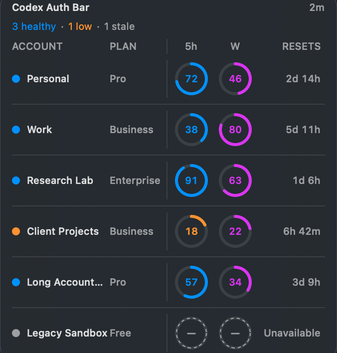
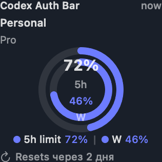

# Codex Auth Bar

<p align="center">
  <strong>Переключение аккаунтов Codex из menu bar и лимиты прямо на рабочем столе macOS.</strong>
</p>

<p align="center">
  <a href="https://github.com/Mesteriis/codex-auth-bar/actions/workflows/ci.yml"></a>
  <a href="https://github.com/Mesteriis/codex-auth-bar/blob/main/LICENSE"></a>
  
  
</p>

<p align="center">
  <a href="README.md">English</a> ·
  <a href="https://mesteriis.github.io/codex-auth-bar/">Сайт</a> ·
  <a href="https://github.com/Mesteriis/codex-auth-bar/releases">Релизы</a> ·
  <a href="SECURITY.md">Безопасность</a>
</p>



Codex Auth Bar — открытое нативное SwiftUI-приложение для macOS. Оно объединяет
переключение аккаунтов Codex, отображение лимитов, конфигурационные профили,
восстановление и виджеты рабочего стола. В проекте нет аналитики и собственного
backend.

Проект вдохновлён и совместим по поведению с
[Loongphy/codex-auth](https://github.com/Loongphy/codex-auth/tree/22d87d1531420102fa2f3d51d134f29344dda27c).
Это независимая реализация, не связанная с OpenAI или Loongphy.

## Возможности

- Переключение между сохранёнными аккаунтами прямо из menu bar.
- **Switch & Restart**: штатное закрытие Codex, смена auth и повторный запуск.
- Лимиты 5h и W для всех аккаунтов в малом, среднем и большом виджетах WidgetKit.
- Добавление аккаунтов через браузер, device code, API key, файл, каталог, JSON
  array или импорт CLIProxyAPI.
- Побайтовые auth snapshots, атомарная запись, резервные копии, журнал транзакции
  и восстановление после сбоя.
- Независимые профили Codex CLI из `<name>.config.toml`.
- Опциональное автоматическое переключение и экспериментальный codext с
  закреплённой SHA-256 проверкой.
- Английский и русский интерфейс, Apple Silicon и Intel.

## Виджеты

| Малый | Средний |
|:---:|:---:|
|  |  |

Активный аккаунт расположен сверху, остальные идут ниже в среднем и большом
форматах. Значения находятся внутри кругов без дублирующих знаков процента.
Snapshot для виджета содержит только отображаемые названия, тарифы, производные
значения лимитов и время сброса. Токенов, API keys, email и идентификаторов
аккаунта в нём нет.

Перед добавлением виджета из галереи macOS один раз запустите Codex Auth Bar.
Виджет доступен только для чтения: нажатие открывает управление аккаунтами. Сам
виджет не переключает аккаунты и не выполняет сетевые запросы.

Запросы WidgetKit на перезагрузку объединяются не чаще одного раза в 15 минут,
обычный интервал timeline — 30 минут. macOS может отложить обновление согласно
собственному бюджету WidgetKit.

## Установка

Текущий developer preview
[`v0.1.0-alpha.1`](https://github.com/Mesteriis/codex-auth-bar/releases/tag/v0.1.0-alpha.1)
доступен в GitHub Releases как universal ad-hoc signed build. Он **не подписан
Developer ID и не notarized**. После первой попытки запуска macOS может
потребовать выбрать **Open Anyway** в System Settings → Privacy & Security.
Устанавливайте preview только если принимаете это ограничение.

Первым обычным публичным релизом станет `v0.1.0-rc.1`: universal DMG,
подписанный Developer ID, notarized и stapled. Обычные unsigned CI-артефакты
по-прежнему предназначены только для разработки.

### Сборка из исходников

Нужны macOS 14+, Xcode 16+ и Xcode Command Line Tools.

```bash
git clone https://github.com/Mesteriis/codex-auth-bar.git
cd codex-auth-bar
swift test --package-path src/Packages/CodexAuthCore
xcodebuild build \
  -project CodexAuthBar.xcodeproj \
  -scheme CodexAuthBar \
  -configuration Debug \
  -destination 'platform=macOS' \
  CODE_SIGNING_ALLOWED=NO
./script/build_and_run.sh
```

Весь Swift-код приложения, package, extension и тестов находится в `src/`.

## Как пользоваться

1. Запустите Codex Auth Bar и нажмите его иконку в menu bar.
2. Через **Добавить** импортируйте auth-файл или выполните изолированный login.
3. Выберите другой аккаунт и используйте **Switch & Restart**, если Codex App
   уже запущен.
4. В **Управление…** доступны псевдонимы, import/export, профили,
   восстановление и experimental-функции.
5. Добавьте Codex Auth Bar из стандартной галереи виджетов macOS.

Registry хранится в `$CODEX_HOME/accounts/registry.json`, активная авторизация —
в `$CODEX_HOME/auth.json`. По умолчанию `CODEX_HOME` равен `~/.codex`.

## Безопасность и приватность

Codex хранит credentials в открытом виде в `auth.json`, поэтому managed
snapshots и backups также содержат credentials. Приложение создаёт рабочий
каталог с правами `0700`, sensitive files с `0600`, отклоняет symlink-файлы и
заменяет auth атомарно.

Удалённое обновление usage включено по умолчанию и передаёт credential
обновляемого аккаунта только на:

- `https://chatgpt.com/backend-api/wham/usage`
- `https://chatgpt.com/backend-api/accounts`
- `https://api.openai.com/v1/me` для API-key identity

ChatGPT endpoints неофициальные и могут измениться. Удалённое обновление можно
выключить в Settings. В приложении нет аналитики, рекламы, telemetry service и
внешнего backend. Полная модель доверия описана в
[docs/security.md](docs/security.md), сообщения об уязвимостях — в
[SECURITY.md](SECURITY.md).

## Совместимость и архитектура

- Swift 6, SwiftUI, WidgetKit, macOS 14+
- Universal `arm64 + x86_64`
- Registry schema v4 и миграция v2/v3
- Нативные `MenuBarExtra`, management window, Settings и WidgetKit extension
- Host app работает без App Sandbox для управления файлами и процессами Codex;
  widget extension остаётся sandboxed и не имеет доступа к сети

Подробности: [docs/architecture.md](docs/architecture.md),
[docs/compatibility.md](docs/compatibility.md) и
[docs/implementation-status.md](docs/implementation-status.md).

## Участие в разработке

Bug reports и небольшие сфокусированные pull requests приветствуются. Перед PR
прочитайте [CONTRIBUTING.md](CONTRIBUTING.md) и выполните проверки из английского
README.

## Лицензия

MIT. См. [LICENSE](LICENSE) и
[THIRD_PARTY_NOTICES.md](THIRD_PARTY_NOTICES.md), где указана атрибуция
закреплённому upstream.
