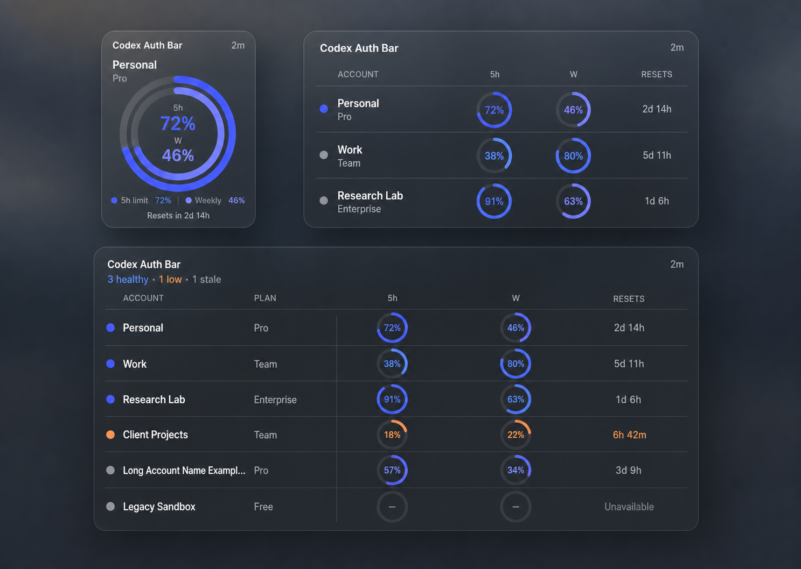

# Codex Auth Widget Design

## Status

Approved for implementation on 2026-07-11.

This specification extends Codex Auth Bar with a read-only native macOS
WidgetKit extension. It preserves the existing macOS 14 minimum, Swift 6 strict
concurrency, universal `arm64 + x86_64` release contract, disabled App Sandbox
for the host application, and the rule that all application and test source
code lives under `src/`.

## Product outcome

The widget makes account capacity visible without opening the menu-bar popover.
It answers three questions at a glance:

1. Which Codex accounts are managed?
2. How much of each account's 5-hour and weekly limits remains?
3. When do those limits reset, and how fresh is the displayed data?

The first release is information-only. It does not switch accounts, refresh the
network, remove accounts, or expose any destructive action. Selecting the
widget may open the Accounts window in Codex Auth Bar.

## Selected visual direction

The approved direction is **Precision Ledger**, option 2 from the Product
Design exploration.



The implementation uses native SwiftUI and WidgetKit primitives rather than a
rasterized mock. It follows the reference's hierarchy:

- graphite/system material surface;
- system typography with strong account names and compact secondary metadata;
- paired indigo radial gauges for normal 5-hour and weekly capacity;
- hairline row separators rather than nested cards;
- orange and red reserved for genuinely low remaining capacity;
- exact numbers alongside every visual encoding.

The system controls widget background material, vibrancy, light/dark rendering,
corner radius, and desktop tinting. The extension must not draw a second opaque
rounded background inside the widget.

## Supported families and layout

One `StaticConfiguration` supports `.systemSmall`, `.systemMedium`, and
`.systemLarge` on macOS.

### Small

- Displays only the active account.
- Shows safe display name and plan.
- Uses one large dual radial gauge: outer arc is 5-hour remaining and inner arc
  is weekly remaining.
- Shows both exact percentages in the center/legend.
- Shows the nearest known reset and snapshot freshness in compact form.
- If there is no active account, uses the standard empty state.

### Medium

- Displays at most three accounts.
- Active account is always first.
- Remaining rows are ordered by attention score, lowest known
  `min(5h, weekly)` first, then localized display name.
- Each row shows account name, plan, two compact radial gauges with exact
  percentages, and concise reset information.
- A small header shows `Codex Auth Bar` and freshness.

### Large

- Displays at most six accounts using fixed semantic columns:
  `Account`, `Plan`, `5h`, `Weekly`, and `Resets`.
- Uses a light row separator and no per-account card.
- If more than six accounts exist, the footer shows
  `+ N more in Codex Auth Bar`.
- Long names truncate at 30 visible characters with an ellipsis.

## Visual semantics

The ring fill always represents **remaining**, not used, capacity.

| Remaining | Semantic presentation |
| --- | --- |
| Unknown | secondary dashed/empty ring and em dash |
| 20–100% | indigo/accent ring |
| 10–19% | orange warning ring |
| 0–9% | red critical ring |

An expired reset is treated as 100% remaining for presentation until a newer
usage snapshot arrives, matching the existing auto-switch scoring semantics.
Color is never the only signal: every ring includes a percentage or unavailable
label, and VoiceOver receives the same numeric/status information.

## Safe shared-data contract

The widget never reads `$CODEX_HOME`, `auth.json`, managed auth snapshots, or
the upstream registry directly. It never performs OpenAI or ChatGPT network
requests. The host app projects the registry into a secret-free snapshot in the
shared App Group container.

App Group identifier:

```text
group.com.mesteriis.CodexAuthBar
```

Shared file:

```text
<App Group Container>/widget/snapshot.json
```

Core public model:

```swift
public struct WidgetSnapshot: Codable, Equatable, Sendable {
    public static let currentSchemaVersion = 1
    public var schemaVersion: Int
    public var generatedAtMilliseconds: Int64
    public var accounts: [WidgetAccountSnapshot]
}

public struct WidgetAccountSnapshot: Codable, Equatable, Identifiable, Sendable {
    public var id: String
    public var displayName: String
    public var plan: PlanType?
    public var isActive: Bool
    public var fiveHour: WidgetLimitSnapshot?
    public var weekly: WidgetLimitSnapshot?
}

public struct WidgetLimitSnapshot: Codable, Equatable, Sendable {
    public var remainingPercent: Double
    public var resetsAtSeconds: Int64?
}
```

The coding contract uses exact snake-case keys. `id` is a SHA-256-derived
stable identifier; it is not the raw account key. `displayName` uses a safe
alias, then a safe workspace name, then a localized ordinal such as
`Account 2`. Candidate names containing `@` or matching credential/JWT patterns
are rejected and fall through to the next safe choice. Email,
account ID, user ID, account key, access token, refresh token, API key, JWT,
auth mode, and auth JSON are forbidden from the shared payload.

`WidgetSnapshotProjector` is a pure core type that converts `RegistryV4` into
the safe model. Tests decode the resulting JSON as an untyped object and fail
if forbidden key names or credential-like values appear anywhere in it.

## Persistence and process boundary

`WidgetSnapshotStore` accepts an injected container URL so unit tests do not
require entitlements. Production resolves the container with
`FileManager.containerURL(forSecurityApplicationGroupIdentifier:)`.

Developer ID builds use the App Group as the primary and expected transport.
For explicitly unsigned local packages, the host also writes the same
credential-free snapshot under its Application Support directory. The local
ad-hoc signing step gives the sandboxed widget a read-only temporary exception
for that single `widget/` directory because App Groups are unavailable without
an Apple provisioning profile. This exception is not part of release signing.

Writing uses a private `widget/` directory, a temporary file in the same
directory, `fsync`, atomic rename, and directory `fsync`. Readers either see the
complete previous snapshot or the complete new snapshot. Invalid, missing, or
future-schema files are not partially rendered.

The host app remains unsandboxed as documented in ADR 0001. The widget
extension enables App Sandbox and receives the App Groups entitlement. Both
targets use the same App Group identifier. Release builds add no file, network,
automation, or keychain entitlement to the extension; only an explicitly local
unsigned package uses the narrow read-only fallback described above.

## Publishing and refresh policy

`WidgetSnapshotPublisher` owns projection, coalescing, persistence, and
`WidgetCenter` reload requests.

Immediate publication and `WidgetCenter.reloadTimelines(ofKind:)` occur after:

- application startup/recovery;
- manual `Refresh all`, `Refresh active`, or `Local only` completion;
- account switch or previous-account switch;
- account import, login import, remove, purge, or clean when visible records
  change;
- alias or workspace-name change;
- auto-switch completion.

Automatic usage changes are coalesced so the widget receives at most one reload
request per 15-minute rolling window. Publishing compares the projected
content before rewriting; unchanged automatic content does not trigger a
reload. A manual refresh updates freshness even if percentages are unchanged.

The `TimelineProvider` returns:

- one entry for now;
- entries for known reset dates in the next 24 hours, provided adjacent entries
  are at least five minutes apart;
- `.after(now + 30 minutes)` as the next normal reload policy.

The widget does not assume WidgetKit will honor an exact time. Dynamic relative
date text is used for reset/freshness presentation where appropriate.

Freshness states:

| Snapshot age | Presentation |
| --- | --- |
| Under 2 hours | normal `Updated … ago` metadata |
| 2–24 hours | visible stale metadata, values retained |
| Over 24 hours | `Stale` warning, values retained |
| Missing/invalid | empty state, no invented values |

If remote usage APIs are disabled, the same contract applies; snapshots update
after structural changes and local-only refreshes.

## Empty, unavailable, and failure states

- No shared container: show `Open Codex Auth Bar to set up the widget`.
- No accounts: show `No managed accounts` and `Add or import an account`.
- Accounts but no active account in small: show `No active account`.
- Missing usage for one window: show a dashed ring and em dash only for that
  window; the other window remains visible.
- Invalid/future snapshot: do not guess or fall back to auth files; render the
  setup state and log only a non-sensitive diagnostic code.
- Host publication failure: the account operation itself still succeeds;
  publication reports a safe app status and preserves the last valid snapshot.

Widget diagnostics never contain the snapshot body or account display names.

## Deep link behavior

The widget uses a single read-only URL:

```text
codexauthbar://accounts
```

The host app registers the scheme, activates as an accessory application, and
opens the existing `Window(id: "accounts")`. No account identifier is included
in the URL. The widget contains no `Button`, `AppIntent`, or per-account link.

## Accessibility and localization

- English and Russian strings live in the widget target's string catalog.
- Each account row combines its children into a single VoiceOver element.
- Ring accessibility values use localized text such as
  `5-hour limit, 72 percent remaining, resets in 2 hours`.
- Unknown and stale states are spoken explicitly.
- Meaning is not encoded only by color or ring position.
- Layout supports larger accessibility text by reducing secondary metadata
  before clipping primary names or percentages.
- Previews cover light, dark, and increased-contrast environments.

## Source and target structure

```text
src/
  CodexAuthBar/
    Services/WidgetSnapshotPublisher.swift
  CodexAuthWidget/
    App/CodexAuthWidgetBundle.swift
    Models/WidgetEntry.swift
    Services/WidgetTimelineProvider.swift
    Views/CodexAuthWidgetView.swift
    Views/LimitRing.swift
    Views/SmallWidgetView.swift
    Views/MediumWidgetView.swift
    Views/LargeWidgetView.swift
    Views/WidgetPreviewHarness.swift
    Resources/Info.plist
    Resources/Localizable.xcstrings
  CodexAuthWidgetTests/
    CodexAuthWidgetTests.swift
  Entitlements/
    CodexAuthBar.entitlements
    CodexAuthWidget.entitlements
  Packages/CodexAuthCore/
    Sources/CodexAuthCore/WidgetSnapshot.swift
    Sources/CodexAuthCore/WidgetSnapshotStore.swift
    Tests/CodexAuthCoreTests/WidgetSnapshotTests.swift
```

The Xcode project adds `CodexAuthWidget.appex` and
`CodexAuthWidgetTests.xctest`. The app embeds and signs the extension. The
widget target depends on `CodexAuthCore` but does not link app-only process or
network services.

## Signing, CI, and release implications

- Host bundle ID remains `com.mesteriis.CodexAuthBar`.
- Extension bundle ID is `com.mesteriis.CodexAuthBar.Widget`.
- Extension deployment target is macOS 14.0.
- Host and extension enable Hardened Runtime in Release.
- Host App Sandbox remains disabled; extension App Sandbox is enabled.
- App Group entitlement is present on both signed products.
- Unsigned CI builds compile and embed both architectures of the extension.
- Runtime App Group validation is part of the signed release gate and cannot be
  claimed before Apple Developer identifiers/profiles are configured.
- Release packaging verifies the nested extension signature and entitlements in
  addition to the existing app and DMG checks.

## Verification strategy

Core tests prove:

- safe projection and exact schema v1 round trip;
- alias/workspace/ordinal display-name precedence;
- no raw identifiers, email, auth mode, or credential fields in encoded JSON;
- remaining values are clamped to `0...100`;
- expired reset presentation becomes 100%;
- attention ordering and six-account truncation metadata;
- atomic store preserves the previous snapshot after injected write failure;
- future schema is rejected without modifying bytes.

App tests prove:

- every foreground workflow publishes for the correct reason;
- automatic reloads are coalesced to 15 minutes;
- manual refresh updates freshness immediately;
- publication failure does not roll back a successful account operation;
- deep link activates the Accounts window.

Widget tests prove:

- 30-minute timeline policy and reset entries at least five minutes apart;
- small/medium/large view models select 1/3/6 accounts;
- active-first and lowest-capacity ordering;
- warning/critical/unavailable/stale/empty semantics;
- EN/RU accessibility values.

Visual QA renders the exact shared SwiftUI components through
`WidgetPreviewHarness` for all three families. The rendered reference is
compared with the approved Precision Ledger image for hierarchy, spacing,
radial-gauge proportions, typography, truncation, and dark-mode contrast.

## Acceptance criteria

- The widget appears in the macOS widget gallery after the containing app has
  been launched at least once.
- Small, medium, and large families render without clipping in light and dark
  mode.
- The widget displays the active account and up to 3/6 managed accounts with
  exact 5-hour and weekly remaining percentages and reset information.
- Manual app actions update the shared snapshot immediately.
- Automatic widget reload requests occur no more than once per 15 minutes;
  normal timeline refresh is 30 minutes.
- Reset-time entries recompute expired windows as 100% without network access.
- No token, JWT, API key, email, raw account/user ID, raw account key, or auth
  JSON reaches the App Group payload, widget logs, previews, or tests.
- The extension performs no network request and cannot switch an account.
- Invalid or stale data degrades visibly without crashing or deleting the last
  valid snapshot.
- The host app remains a no-Dock menu-bar application and opens its Accounts
  window from the widget URL.
- Core, app, widget, UI, analyze, universal build, secret scan, and packaging
  gates all pass.

## Platform references

- [Creating a widget extension](https://developer.apple.com/documentation/widgetkit/creating-a-widget-extension)
- [Keeping a widget up to date](https://developer.apple.com/documentation/widgetkit/keeping-a-widget-up-to-date/)
- [Configuring App Groups](https://developer.apple.com/documentation/xcode/configuring-app-groups)
